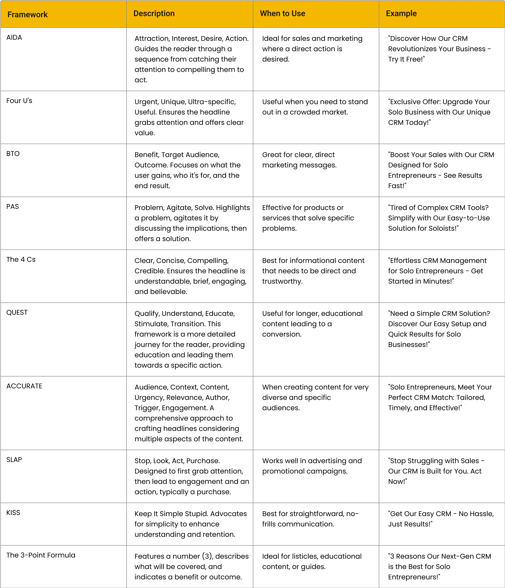
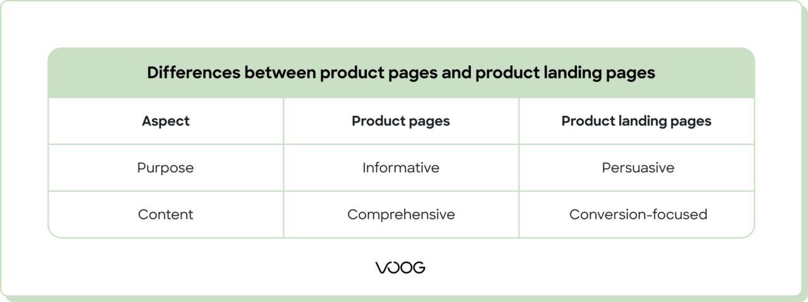

# Api Docs

## Deploy

## User Auth
1. auth/register
2. auth/login
3. auth/token/refresh

## Github connect
1. show button with generated key from generator/hash/oauth
2. user redirect to github
3. oauth/github/connect/hash-{hash}
4. oauth/github/connect/check
5. redirect to profile page

## Design
### Freemium to use illustrations
1. https://unblast.com/
2. https://undraw.co/illustrations
3. https://www.drawkit.com/
4. https://www.humaaans.com/
5. https://icons8.com/illustrations , https://icons8.com/icons/set/social-media
6. https://ui8.net/
7. https://www.freepik.com/free-photos-vectors/landing-page-design

### Tools
1. background remove https://www.remove.bg/upload
2. favicon create https://favicon.io/favicon-converter/
3. css gradients https://cssgradient.io/
4. color palette generator https://mycolor.space/?hex=%233C9CFD&sub=1
5. font https://www.fontsquirrel.com/fonts/aller
6. mailer https://mailpit.axllent.org/docs/
7. power words for content build https://optinmonster.com/700-power-words-that-will-boost-your-conversions/

### Advices

Adding an FAQ: Putting an FAQ section at the bottom would be great, especially for such finance-related stuff where people often have many questions.

The first thing we have are ten popular copywriting frameworks with their definitions, ideal usage scenarios, and an example to make things clearer.

Consider spicing things up with new elements like VR, AR, or 3D images. Shopify's research showed a 94% increase in conversions with these visuals.

