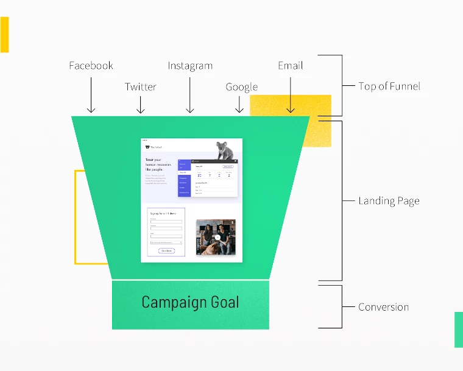
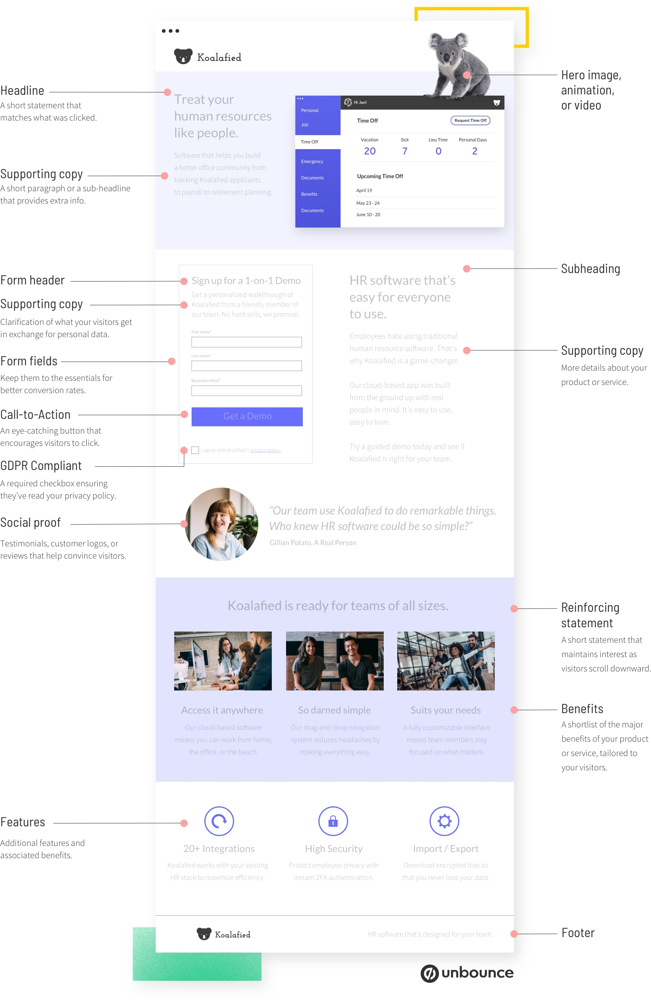

# Landing Page
## Purpose

### Why to use Landing Page

## Components

No two landing pages are the same. That said, there are five core elements that every high-converting landing page must have:

* A unique selling proposition (USP)
* A hero image or video
* The benefits of your offering
* Some form of social proof
* A single conversion goal (or your call to action)

## Sources
* [The Anatomy of a Landing Page](https://unbounce.com/landing-page-articles/the-anatomy-of-a-landing-page/)
* [Why Should I Use Landing Pages?](https://unbounce.com/landing-page-articles/why-should-i-use-landing-pages/)
* [Templates](https://unbounce.com/landing-page-templates/landing-pages/)
